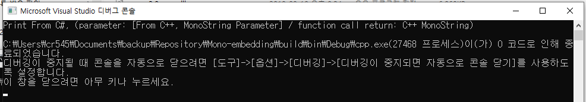

# Mono embedding sample project

### 필요사항

- mono 폴더에 lib 복사 ( windows install mono 기준 C:\Program Files\Mono\lib )
- mono 폴더에 mono-2.0-sgen.dll 복사 ( windows install mono 기준 C:\Program Files\Mono\bin\mono-2.0-sgen.dll )

